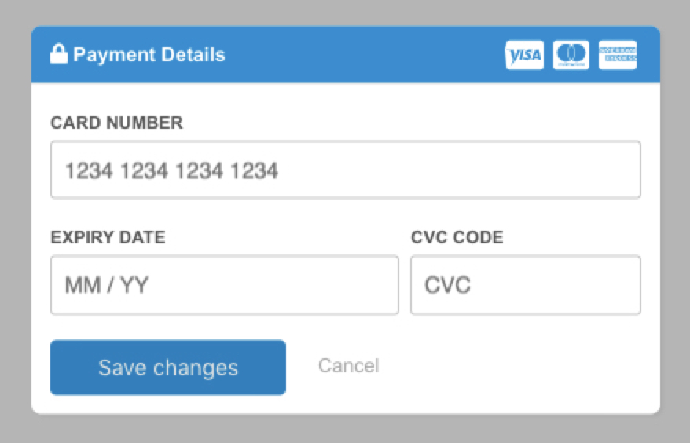

[](https://forthebadge.com) [](https://forthebadge.com)

# react-stripe-modal

<p align="center"></p>

# How to use

Make sure to include the stripe api
```html
<script src="https://js.stripe.com/v3/" async></script>
```

## Sample Usage

```javascript
import React from 'react';
import { render } from 'react-dom';
import ReactStripeModal from 'react-stripe-modal';

class MyComponent extends React.Component {

    constructor(props) {
        super(props);
        this.reactStripeModalRef = null;
        this.onSubmit = this.onSubmit.bind(this);
        this.openStripeModal = this.openStripeModal.bind(this);
    }

    // Open the stripe modal
    openStripeModal() {
        this.reactStripeModalRef.open();
    }

    // Handle the submission of the stripe form
    onSubmit(token) {
        console.log(token);
    }

    render() {
        return (
            <div>
                <h2>Card Details</h2>

                <input type="button" onClick={this.openStripeModal} value={"Update Card Details"} />

                <ReactStripeModal 
                    ref={e => this.reactStripeModalRef = e}
                    stripePublicKey={"put_your_api_key_here"} 
                    headerBackgroundColor={"#098dd5"}
                    headerColor={"#fff"}
                    buttonStyle={{ backgroundColor: "#098dd5", borderColor: "#098dd5" }}
                    customerEmail={"demo@website.com"}
                    customerName={"Matt"}
                    onSubmit={this.onSubmit}
                    buttonLabel={"Save Changes"}
                />
            </div>
        )
    }
}

// Render the React component
render(
    <MyComponent />,
    document.getElementById("root")
);
```